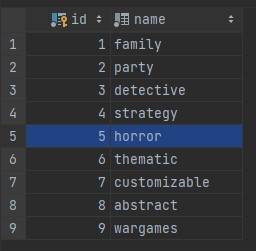
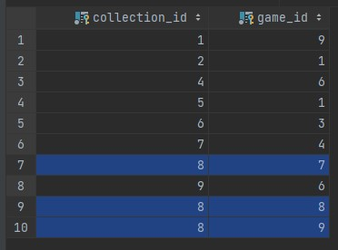
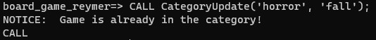
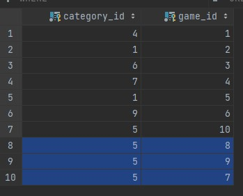

# Лабораторная работа 3

## Язык SQL DML

### Цели работы
Познакомиться с языком создания запросов управления данными SQL-DML.

### Программа работы
1. Изучение SQL-DML.
2. Выполнение всех запросов из списка стандартных запросов. Демонстрация результатов преподавателю.
3. Получение у преподавателя и реализация SQL-запросов в соответствии с индивидуальным заданием. Демонстрация результатов преподавателю.
4. Сохранение в БД выполненных запросов SELECT в виде представлений, запросов INSERT, UPDATE или DELETE -- в виде ХП. Выкладывание скрипта в GitLab.

**Список стандартных запросов**
1. Сделайте выборку всех данных из каждой таблицы
2. Сделайте выборку данных из одной таблицы при нескольких условиях, с использованием логических операций, LIKE, BETWEEN, IN (не менее 3-х разных примеров)
3. Создайте в запросе вычисляемое поле
4. Сделайте выборку всех данных с сортировкой по нескольким полям
5. Создайте запрос, вычисляющий несколько совокупных характеристик таблиц
6. Сделайте выборку данных из связанных таблиц (не менее двух примеров)
7. Создайте запрос, рассчитывающий совокупную характеристику с использованием группировки, наложите ограничение на результат группировки
8. Придумайте и реализуйте пример использования вложенного запроса
9. С помощью оператора INSERT добавьте в каждую таблицу по одной записи
10. С помощью оператора UPDATE измените значения нескольких полей у всех записей, отвечающих заданному условию
11. С помощью оператора DELETE удалите запись, имеющую максимальное (минимальное) значение некоторой совокупной характеристики
12. С помощью оператора DELETE удалите записи в главной таблице, на которые не ссылается подчиненная таблица (используя вложенный запрос)

### Ход работы

Заполним БД данными с помощью [генератора](https://gitlab.icc.spbstu.ru/rejmer.id/db-course/-/blob/lab2/main.py) из лабораторной работы 2. Установим параметры генерации равными 10.

Скрипт реализации стандартных запросов: [script3](https://gitlab.icc.spbstu.ru/rejmer.id/db-course/-/blob/lab3/script3.sql).

**1. Сделайте выборку всех данных из каждой таблицы**

Используем запрос `SELECT * FROM table;` для каждой созданной таблицы.

**2. Сделайте выборку данных из одной таблицы при нескольких условиях, с использованием логических операций, LIKE, BETWEEN, IN (не менее 3-х разных примеров)**

Используем `LIKE` при определении акций, которые начинаются на 'c', у которых процент скидки более (или равен) 50.

Используем `IN` при определении заказов, у которых статус 'ready' или 'in progress' и сумма заказа превышает 5000.

Используем `BETWEEN` при определении настольных игр, которые были выпущены в промежуток от 01/01/2010 до 01/01/2020 и не имеют возрастные ограничения от 0 до 4+.

**3. Создайте в запросе вычисляемое поле**

Реализуем запрос, который предоставит название и период тех акций, которые начались с 01/01/2010 по 01/01/2022 со скидкой в 50 и более процентов.
Период акции представлен как диапазон дат: start   -   finish.

**4. Сделайте выборку всех данных с сортировкой по нескольким полям**

Сделаем выборку всех данных из таблицы акции, сортируя по размеру скидки (по убыванию) и началу акции (по возрастанию).

**5. Создайте запрос, вычисляющий несколько совокупных характеристик таблиц**

Определим максимальную, минимальную и среднюю стоитмость игр.

**6. Сделайте выборку данных из связанных таблиц (не менее двух примеров)**

С помощью `INNER JOIN` по таблице заказов определим расширенную информацию о заказе: укажем назание игры и никнейм пользователя у каждой записи в таблице заказов. 

С помощью `RIGHT JOIN` определим никнеймы всех пользователей и их заказы (order_id), если такие имеются.  

**7. Создайте запрос, рассчитывающий совокупную характеристику с использованием группировки, наложите ограничение на результат группировки**

Определим топ продаваемых игр с информацией о названии игры, возрастном ограничении и количестве продаж. Пусть будут представлены игры с максимальным возрастным ограничением 16+.

**8. Придумайте и реализуйте пример использования вложенного запроса**

Реализуем запрос 7 в форме вложенного запроса.

**9. С помощью оператора INSERT добавьте в каждую таблицу по одной записи**

Добавим записи аналогично добавлению в [лабораторной работе 1-2](https://gitlab.icc.spbstu.ru/rejmer.id/db-course/-/blob/lab1-2/script2.sql).
Ограничимся добавлением по одной записи в каждую таблицу. Так как изначально мы заполнили БД данными с параметром генерации 10, то используем id игры, коммерческой информации и пользователя равные 11. 

**10. С помощью оператора UPDATE измените значения нескольких полей у всех записей, отвечающих заданному условию**

Обновим статус заказа: пусть все заказы со статусом 'ready' будут доставлены 'delivered'.

**11. С помощью оператора DELETE удалите запись, имеющую максимальное (минимальное) значение некоторой совокупной характеристики**

Удалим из таблицы заказов самый ранний заказ, у которого статус 'delivered'.

**12. С помощью оператора DELETE удалите записи в главной таблице, на которые не ссылается подчиненная таблица (используя вложенный запрос)**

Удалим из таблицы акций те акции, которые не были применены (отсутствуют в таблице sale_intersection).

### Индивидуальное задание

Скрипт по индивидуальному заданию: [script4](https://gitlab.icc.spbstu.ru/rejmer.id/db-course/-/blob/lab3/script4.sql). 

1. Вывести топ-5 самых дорогих коллекций исходя из средней цены игр, которые в них входят.

2. Вывести статистику по заказам во время акций, подсчитав во временных рамках каждой акции следующее: количество проданных игр, общую стоимость проданных игр, количество заверешнных заказов, количество покупателей, которые эти заказы совершали. Вывести эти метрики вместе со всей информацией о каждой акции, упорядочив по общей стоимости.

3. Написать хранимую процедуру, которая переносит все игры заданной коллекции в заданную категорию (коллекция и категория – параметры хранимой процедуры), а если они уже в этой категории, то вывести сообщение об этом (RAISE NOTICE ...).

Рассмотрим реализацию на примере: коллекия - fall, категория - horror.  
Обратимся к таблицам **collection, category и collection_intersection**:

Таким образом, в категорию попадают игры с id 7, 8, 9. Рассмотрим, к каким категориям они относятся изначально по таблице **category_intersection**:

По таблице видно, что игра 8 уже принадлежит категории horror (5).

Работа процедуры:

Видим сообщение, что одна игра уже принадлежит категории, как мы и ожидали. Рассмотрим вновь таблицу **category_intersection**:

Действительно, игры 7, 8 и 9 (из коллеции fall) принадлежат категории 5 (horror).

Поробуем вновь вызвать процедуру:

Видим, что все игры и так принадлежат категории horror. Процедура работает корректно.

### Вывод
В ходе выполнения лабораторной работы 3 был изучен языком создания запросов управления данными SQL-DML. Выполнены все запросы из списка стандартных запросов. Реализовано сохранение в БД выполненных запросов SELECT в виде представлений, запросов INSERT, UPDATE или DELETE - в виде ХП. 
