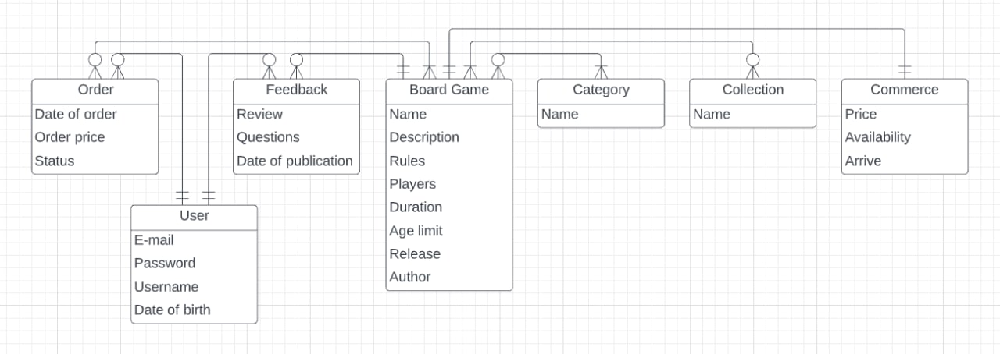
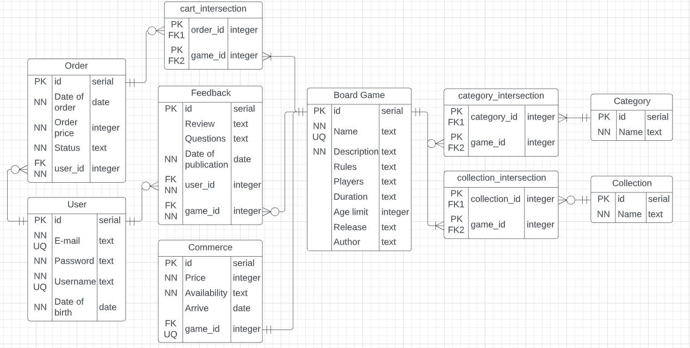

# Лабораторная работа 1-1
## Разработка структуры БД
### Цели работы
Познакомиться с основами проектирования схемы БД, способами организации данных в SQL-БД.

### Программа работы
1. Создание проекта для работы в GitLab.
2. Выбор задания (предметной области), описание набора данных и требований к хранимым данным в свободном формате в wiki своего проекта в GitLab.
3. Формирование в свободном формате (предпочтительно в виде графической схемы) cхемы БД, соответствующей заданию. Должно получиться не менее 7 таблиц.
4. Согласование с преподавателем схемы БД. Обоснование принятых решений и соответствия требованиям выбранного задания.
5. Выкладывание схемы БД в свой проект в GitLab.
6. Демонстрация результатов преподавателю.

### Ход работы

**Создание проекта для работы в GitLab**

Репозиторий проекта: https://gitlab.icc.spbstu.ru/rejmer.id/db-course  
В ветке lab1-1 находятся все файлы по лабораторной работе 1-1.

**Выбор задания и описание набора данных** 

В качестве задния был выбран Интернет-магазин настольных игр.  
В нем необходимо хранить:
- список игр с информацией о количестве игроков и длительности игры, возрастные ограничения, краткое описание и правила игры, год выпуска, производитель;
- цену каждой игры, информацию о наличии, даты поступлений;
- категории игр;
- серии игр;
- отзывы и вопросы покупателей;
- инфомацию о пользователях интернет-магазина: электронная почта, пароль, никнейм, дата рождения;
- информацию о заказах: дата заказа, список товаров, сумма и статус заказа.

**Формирование таблиц**

Концептуальная ER-диаграмма:

Даталогическая модель БД:

- Каждая игра **(board game)** имеет определенную коммерческую информацию **(commerce)**. 
- Игры могут принадлежать (или не принадлежать) определенной серии игр **(collection)**. Если существует серия игр, она обязана содержать хотя бы одну игру (ограничение в одну игру связано с тем, что, если существует некая серия игр, но в магазине представлена только одна игра из серии, то такая серия может существовать).  
- Игра должна быть отнесена к какой-либо категории **(category)**. Категории без игр могут существовать (так как категории не сильно масштабируются со временем — зачастую они все определены и новые не появляются, то все существующие категории могут быть представлены в Интернет-магазине, наличие игр во всех категориях не требуется). 
- Пользователь **(user)** может оформить/не оформлять заказ **(order)** или оставить/не оставлять обратную связь (задать вопрос, оставить отзыв) — **feedback**. 
- Каждый заказ, как и обратная связь, относятся к конкретному пользователю.
- Обратная связь соотносится с конкретной игрой.
- Заказ должен содержать не менее 1 игры, при отсутствии игр в заказе считаем, что заказ не существует. 

### Вывод

В ходе выполнения лабораторной работы 1-1 изучены основы проектирования схемы БД. Составлено описание набора данных Интернет-магазина настольных игр, сформированы модели: концептуальная и даталогическая. Концептуальная модель - информационная модель наиболее высокого уровня абстракции, без ориентации на конкретную СУБД и модель данных. Даталогическая модель представлена реляционной моделью данных, в которой с помощью ключей и атрибутов описаны связи между таблицами.
