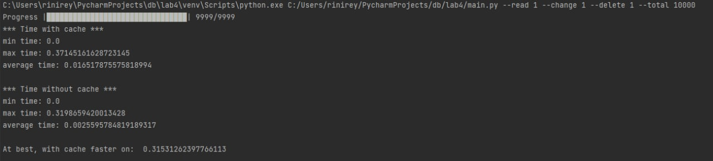
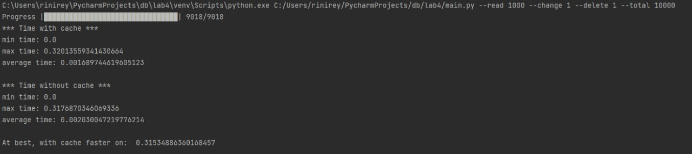
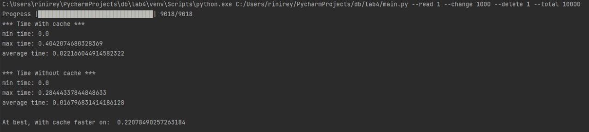
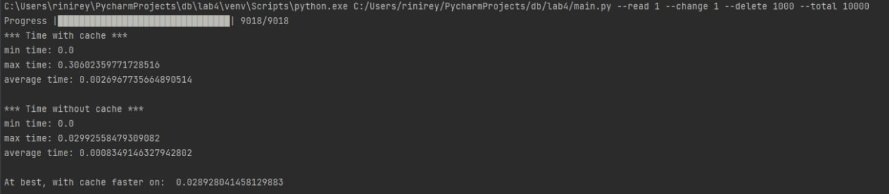

# Лабораторная работа 4

## Кэширование

### Цели работы

Знакомство с алгоритмами кэширования. В рамках данной работы необходимо разработать кэширующий SQL-proxy - программу, которая принимала бы запросы к БД, отправляла эти запросы в БД, сохраняла бы результаты в хранилище. Если приходит повторный запрос на чтение - выдавала запросы из хранилища, если приходит запрос на изменение - сбрасывала бы значения всех запросов, результаты которых станут неактуальными после внесенных изменений.

### Программа работы

1. Общее описание:
    - для данной работы необходимо выбрать часть таблиц БД (3+), для которой можно придумать/использовать осмысленные SQL-запросы, необходимые для выполнения пользовательских функций
    - в рамках работы необходимо реализовать две программы: кэширующий прокси и программа для выполнения запросов и измерения результатов
2. Выбор понравившегося способа кэширования:
    - в памяти программы
    - с использованием внешних хранилищ
    - во внешней памяти
3. Реализация выбранного способа
    - преобразование входных запросов
    - выбор ключа для хранения результатов
    - реализация алгоритма поиска сохраненных результатов, которые надо сбросить после внесения изменений в БД
4. Снятие показательных характеристик
    - в программе для формирования потока запросов к БД на чтение/изменение/удаление должна быть возможность настройки соотношения запросов, количества запросов разных типов в потоке и измерения временных характеристик: среднее/минимальное/максимальное время выполнения запроса по типу, необходимо иметь возможность проанализировать эффективность кэширования в различных сценариев: преимущественно чтение, преимущественно изменение, преимущественно удаление
    - измерения можно производить путем простого сравнения отметок текущего времени до и после выполнения запросов
5. Анализ полученных результатов и сравнение реализаций с кэшем и без между собой.
6. Демонстрация результатов преподавателю.

### Ход работы

Для реализации кэширования был выбран Redis (remote dictionary server) — резидентная система управления базами данных класса NoSQL с открытым исходным кодом, работающая со структурами данных типа «ключ — значение». Redis обеспечивает время отклика на уровне долей миллисекунды и позволяет приложениям, работающим в режиме реального времени, выполнять миллионы запросов в секунду. 

Вначале запустим [script1](https://gitlab.icc.spbstu.ru/rejmer.id/db-course/-/blob/lab2/script1.sql), который был создан в рамках лабораторной работы 1-2. Данный скрипт пересоздаст БД и создаст все необходимые таблицы. 

Далее запустим [генерацию данных](https://gitlab.icc.spbstu.ru/rejmer.id/db-course/-/blob/lab2/main.py) из лабораторной работы 2: создадим 1000 записей в нашей БД. 

Запустим [программу](https://gitlab.icc.spbstu.ru/rejmer.id/db-course/-/blob/lab4/main.py), реализованную в рамках данной лабораторной работы. Имеются несколько параметров запуска:
- --read - параметр определяющий соотношение для формирования потока запросов на чтение (default=1)
- --change - параметр определяющий соотношение для формирования потока запросов на изменение (default=1)
- --delete - параметр определяющий соотношение для формирования потока запросов на удаление (default=1)
- --total - параметр определяющий количество всех запросов (default=10000)

Сформируем входные запросы.
- пусть **possible_queries** содержит 14 запросов на чтение и по 3 запроса на изменение и удаление _(так как только запросы на чтение будут сохраняться в кэш, а запросы на удаление и изменение будут всегда обрабатываться непосредственно БД, то количество разнообразных запросов изменение/удаления не принципиально для анализа эффективности кэша)_. Используем [запросы](https://gitlab.icc.spbstu.ru/rejmer.id/db-course/-/blob/lab3/script3.sql), описанные в лабораторной работе 3. 
- в **queries** непосредственно сформируем входные запросы: в зависимости от соотношения и количества всех запросов, заданных параметрами запуска, определим количество запросов каждого типа. Рандомно сформируем списки запросов каждого типа из **possible_queries** и рандомно перемешаем полученный поток запросов.

Далее обработаем каждый запрос из потока с использованием кэша и без него. Так как кэш представляет собой структуру данных типа «ключ — значение», то в качестве ключа будем использовать сам запрос **query**, значение — таблицы **tables**, к которым направлен этот запрос, и результат выполнения запроса **data**. 
- Работа с кэшем:
    - представлена в **cache**. Определим первое слово(тип) в запросе. 
        - запрос на **чтение**: проверим, есть ли такой запрос в кэш.
            - если такой запрос **есть в кэше** — берем значение из кэша.
            - если такого запроса **нет в кэше** — обращаемся к БД и добавляем данные в кэш.
        - запрос на **изменение/удаление**: 
            - обращаемся к БД за актуальными данными.
            - определяем таблицы, к которым был направлен запрос, чтобы определить записи в кэше, которые нужно сбросить после внесения изменений в БД.
            - удаляем неактуальные записи из кэша.
- Работа без кэша:
    - представлена в **db** — непросредственный запрос к БД. 

Во время выполнения каждого запроса будем фиксировать время начала и окончания выполения при работе с кэшем и без него — реализовано в **times**. Также при определении времени работы будем сравнивать время работы с кэшем и без него, чтобы определить максимальную эффективность кэша.

Проанализируем временные характеристики с помощью **time_characteristics**: узнаем минимальное, максимальное и среднее время работы с кэшем и без него.

Результат работы при соотношении 1(чтение):1(изменение):1(удаление) на 10000 запросов. 

Результат работы при соотношении 1000(чтение):1(изменение):1(удаление) на 10000 запросов. 

Результат работы при соотношении 1(чтение):1000(изменение):1(удаление) на 10000 запросов. 

Результат работы при соотношении 1(чтение):1(изменение):1000(удаление) на 10000 запросов. 

Эффективность кэша очевидна при большом количестве запросов на чтение. Запросы на изменение и удаление менее эффективны, так как в реализованной программе при таких запросах идет обращение к БД, за счет чего увеличивается время обработки запроса.

### Вывод

В ходе выполнения лабораторной работы 4 разработан кэширующий SQL-proxy, который принимает запросы к БД, отправляет их в БД и сохраняет результаты в хранилище. Если приходит повторный запрос на чтение - выдаются запросы из хранилища, если приходит запрос на изменение/удаление - сбрасываются значения всех запросов, результаты которых станут неактуальными после внесенных изменений. В качестве хранилища кэша был выбран Redis.
